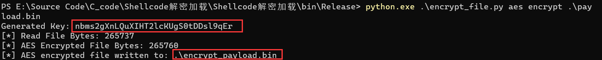
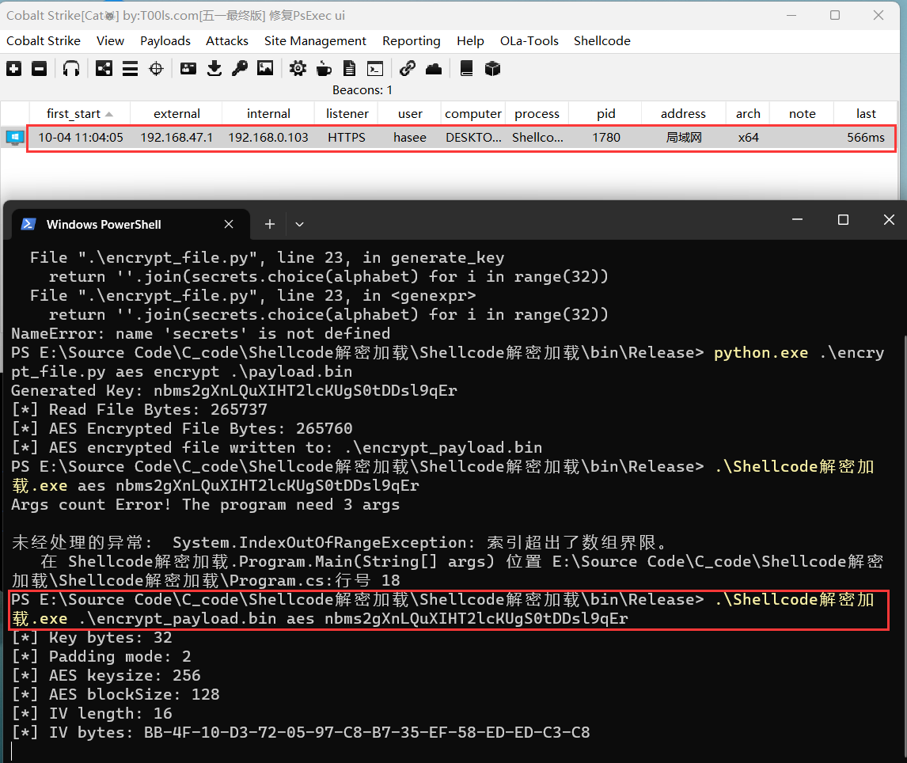

# 项目简介

这个项目提供了一个工具，用于解密并加载shellcode。它支持RC4和AES两种解密方法，并使用DInvoke来动态调用WinAPI函数，从而尝试绕过某些安全解决方案

DInvoke 是一个用于在 Windows 上动态替换 PInvoke 的库。DInvoke 包含了强大的原始功能，可以智能地组合使用，以精确地从磁盘或内存动态调用非托管代码。这可以用于多种目的，如 PE 解析、智能动态 API 解析、运行时动态加载 PE 插件、进程注入和避免 API 钩子。


# 功能

- **解密Shellcode**: 支持RC4和AES两种解密算法。
- **动态API调用**: 使用DInvoke动态调用WinAPI函数。
- **反沙箱技术**: 通过检查系统进程数量来尝试检测沙箱环境。


# 使用方法

使用encrypt.py对payload文件进行aes或rc4加密，随后会在控制台输出密钥以及当前目录生成加密后的payload文件, 如下是aes加密的例子:

```
 python.exe .\encrypt_file.py aes encrypt .\payload.bin
```




再使用本项目解密shellcode并加载, 使用方法如下:

```
Shellcode解密加载.exe [payload_path] [decryption_method] [key]
```

- `payload_path`: 加密的shellcode的路径。
- `decryption_method`: 使用的解密方法，可以是`rc4`或`aes`。
- `key`: 解密密钥。

	


